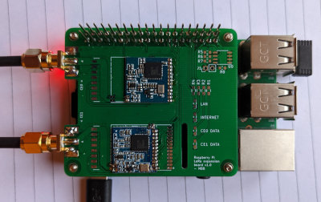

# Raspberry Pi LoRa gateway HAT for RFM9x, DRF1278F and XL1278-SMT boards

A somewhat 'universal' LoRa gateway HAT for RFM9x, DRF1278F and XL1278-SMT boards loosely based upon [Raspberry Pi+ LoRa(TM) Expansion Board](https://store.uputronics.com/index.php?route=product/product&path=61&product_id=68) and designed for the [PiInTheSky/lora-gateway](https://github.com/PiInTheSky/lora-gateway) code.

_Populated module installed on a Rapsberry Pi 2_

# Configuration

The board is designed for use with [PiInTheSky/lora-gateway](https://github.com/PiInTheSky/lora-gateway). See [Software/gateway-sample.txt](Software/gateway-sample.txt) for a starting point configuration. Note DIO5_0=1 must be set as unlike the rest it is not the default. WiringPi seems to rather unhelpfully offer a third 'standard' for Rapsberry Pi pins. [WiringPi GPIO pinout](https://pinout.xyz/pinout/wiringpi_gpio_pinout) is good reference showing equivalent BCM, WiringPi and expansion header pin numbers.

# Testing

Only the configuration pictured above (DRF1278F in CE0 and XL1278-SMT in CE1) has been tested. Neither the indicator LEDs nor the Pi hat EEPROM have been populated and tested yet.

Note [PCB layout issues with v1.0](https://github.com/matburnham/lora-gateway-pi/issues/1), notably that the XL1278-SMT footprint is slightly out as the through-holes don't line up. Surface mounting the module works perfectly fine.

# Module identification

_HOPERF RFM98W_

_Dorji DRF1287F_

 

_HR-WT XL1278-SMT_

Note: while the DRF1278F and XL1278-SMT boards look similar, their pinouts are significantly different.

## Confusion

There is a lot of confusion between Ebay and AliExpress sellers alike. One ebay seller even showing photos of both types of boards on the same listing. So check carefully, or use what you're given with this either/or breakout.

# Documentation

CI/CD documentation generation 

TODO: links to generated documentation, etc.

## Version 1.0

## Version 1.1

# Libraries

* KiCad symbol and footprint libraries for DRF1278F and XL1278-SMT for KiCad are at [kicad-libs](https://github.com/matburnham/kicad-libs)

# References

* Inspired by Uputronics' [Raspberry Pi+ LoRa(TM) Expansion Board](https://store.uputronics.com/index.php?route=product/product&path=61&product_id=68)

* [Dorji DRF1278F datasheet](http://www.dorji.com/docs/data/DRF1278F.pdf) | [respository copy](Docs/DRF1278F.pdf)
* Closest information to a [XL1278-SMT datasheet](http://www.hr-wt.com/html_products/XL1278-SMT-59.html) | [respository screenshot](Docs/screencapture-hr-wt-html-products-XL1278-SMT-59-html-2021-02-26-15_49_33.png)
